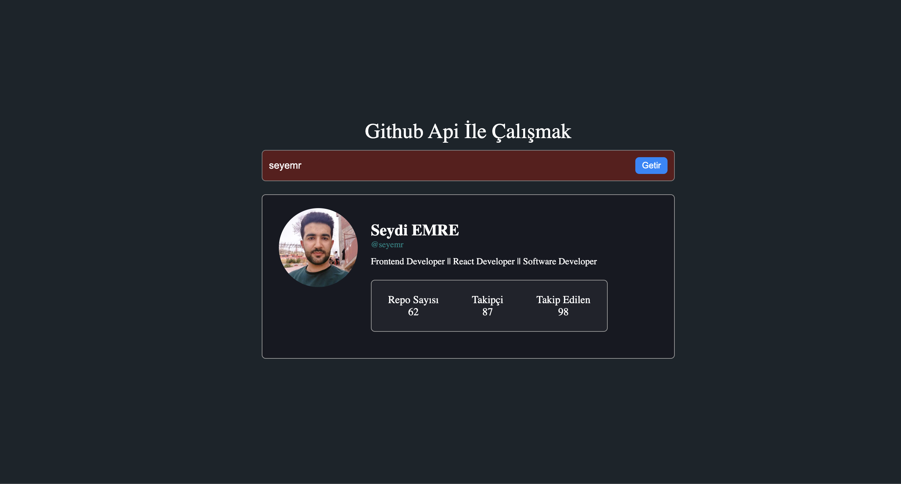

# Foto

# Demo Link 

- https://659ee7636ba0e7149c5993b9--stalwart-praline-841bb3.netlify.app/

main.js sayfasında bulunan clasName = stats olan divin içine isteyen aşağıdaki kodları ekleyebilir

 

    

        
            ${data.location ||"BilgiYok"}
        
    

    

        
            ${data.blog || "Bilgi Yok"}
        
    

    

        
            ${data.twitter_username||"Bilgi Yok"}
        
    

    

        
            ${data.company || "Bilgi Yok"}
        
    
<

 